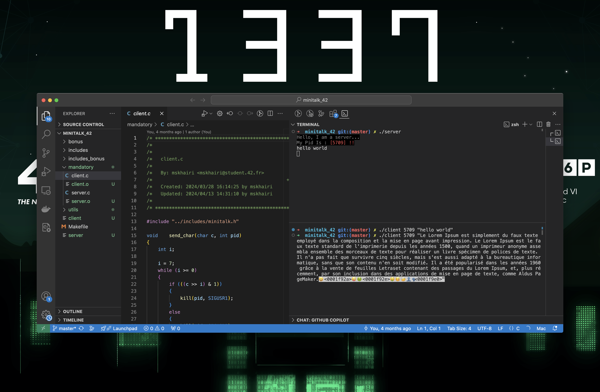
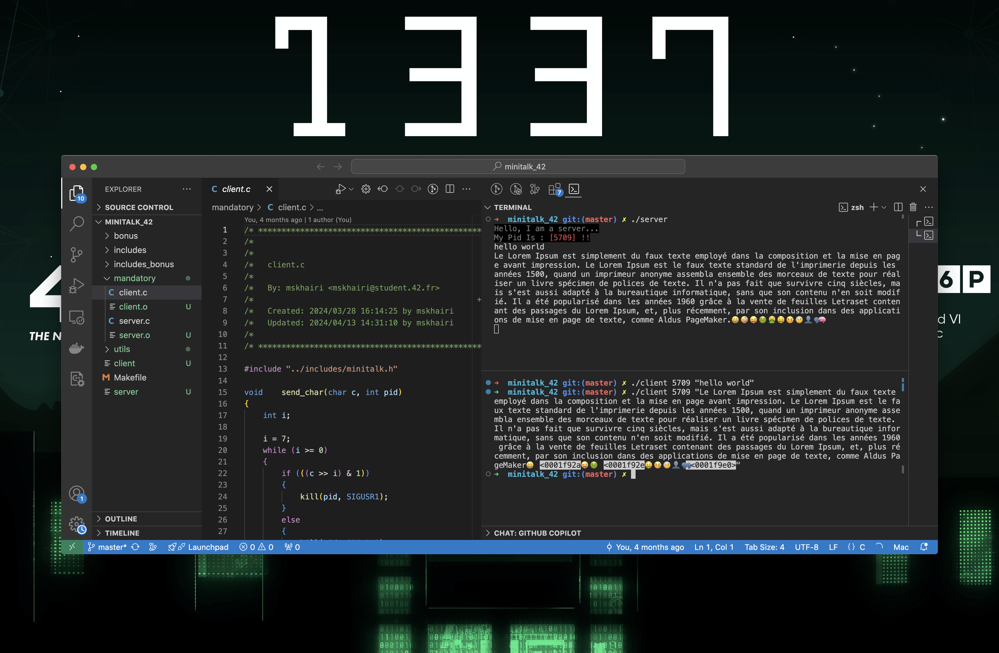

## 42 minitalk project

 
  

## Project Overview

The <strong>Minitalk 42</strong> project focuses on creating a simple client-server communication program using Unix signals. The objective is to implement a messaging system where a client can send messages to a server, one character at a time, and the server can reconstruct and display the message. This project enhances understanding of inter-process communication (IPC), signal handling, and low-level C programming.

## Features

<ul>
  <li>Implements communication between a client and server using Unix signals <code>SIGUSR1</code> and <code>SIGUSR2</code>.</li>
  <li>Handles the transmission of text messages, one character at a time, via signal-based communication.</li>
  <li>Ensures reliable message delivery by confirming reception of each signal.</li>
  <li>Manages edge cases such as slow message reception and large messages.</li>
  <li>Includes error handling for signal failures and invalid input.</li>
</ul>

## Installation

To install and run this project:

<pre>
git clone https://github.com/mahmoudskhairi/minitalk_42.git
cd minitalk
make
</pre>

## Usage

Here’s an example of how to run the server and client in the Minitalk project:

<pre>
# In one terminal, run the server
./server

# In another terminal, run the client and send a message
./client <server_pid> "Hello, 42!"
</pre>

The client sends the message "Hello, 42!" to the server by transmitting one bit at a time using signals.

## Real examples

  

  

<h2 id="contact">Contact</h2>

For any questions, feedback, or issues, feel free to reach out:

<ul>
  <li>Email: <a href="mailto:mahmoud.skhairi@gmail.com">mahmoud.skhairi@gmail.com</a></li>
  <li>LinkedIn: <a href="https://www.linkedin.com/in/mahmoud-skhairi" target="_blank">mahmoud skhairi</a></li>
</ul>

<h2>Happy Coding!</h2>
